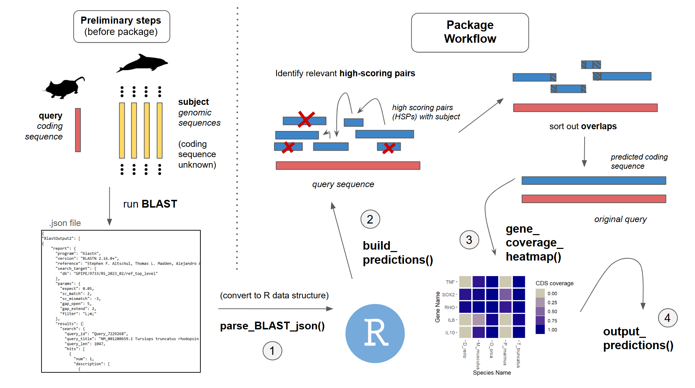

<!-- README.md is generated from README.Rmd. Please edit that file -->

# euPredictR

An R package for predicting protein-coding gene sequences in novel
eukaryotic organisms based on sequence homology, using raw output
generated by the Basic Local Alignment Search Tool (BLAST) algorithm.

<!-- badges: start -->
<!-- badges: end -->

## Description

`euPredictR` is a tool that streamlines and add new functionality to
workflows that use the Basic Local Alignment Search Tool (BLAST)
algorithm for sequence homology-based gene prediction in eukaryotic
organisms. In particular, `euPredictR` focuses on the downstream process
of parsing and analyzing raw BLAST output to construct protein-coding
sequence predictions for novel species, rather than running the
algorithm itself. After constructing gene predictions, the tool allows
users to assess the quality of the genes it predicts by providing gene
completeness estimates as visual output. There currently lacks a unified
interface or package for users to conduct downstream analyses of BLAST
results in eukaryotic gene prediction contexts, nor any that help
directly visualize the results; this is the gap that `euPredictR` fills.
The package was developed using `R version 4.4.1 (2024-06-14)`,
`Platform: x86_64-w64-mingw32/x64` and
`Running under: Windows 10 x64 (build 19045)`.

The biological context of the package and the specific terminology that
the documentation uses is elaborated upon more in the
`Biological Context` section at the bottom and in the provided vignette.

## Installation

To install the latest version of the package:

``` r
install.packages("devtools")
library("devtools")
devtools::install_github("tonyxieuoft/euPredictR", build_vignettes = TRUE)
library("euPredictT")
```

## Overview

``` r
ls("package:euPredictR")
data(package = "euPredictR") 
browseVignettes("euPredictR")
```

`euPredictR` currently contains 5 functions.

1.  ***parse_BLAST_json*** for parsing a single raw BLAST output file
    provided in .json format. The function stores the parsed results in
    a nested list and data frame format for ease of access.

2.  ***parse_multiple_BLAST_json*** for parsing multiple raw BLAST
    output .json files in a given directory.

3.  ***build_predictions*** for creating protein-coding sequence (a.k.a
    coding sequence or CDS) prediction models for genes of particular
    species, based on parsed BLAST results.

4.  ***gene_coverage_heatmap*** for visualizing gene coverage/prediction
    completeness of predicted coding sequences using a heatmap.

5.  ***output_predictions*** for outputting the gene predictions in
    FASTA format.

The package also contains a raw blast output dataset in RawBlastList
format, called sample_raw_blast_list. Refer to package vignette for more
details. An overview of the package is illustrated below. (User input
requirements are elaborated more in the biological context section).



Planned for the future: A function that conducts phylogenetic analysis
on the predicted coding sequences of the same gene for different
species. This can be used as an additional validation step for predicted
gene quality.

## Contributions

The author of the package is Tony Xie.

The `parse_BLAST_json()` function and associated helpers made use of
various packages. `dplyr` helped with data frame manipulation,
`configr`, `readr`, and `rjson` helped with converting a .json input
file into a nested R list, and `stringr` and `tools` helped with
miscellaneous string manipulation tasks. The structure of BLAST .json
output was elucidated in the BLAST tutorial by Wheeler et al. Otherwise,
the author came up with the rest of the logic and wrote the function
code and documentation themselves.

The algorithms in the `build_predictions()` function and associated
helpers are partially inspired by the software Splign, developed by
Kapustin et al. in the late 2000s. More specifically. the assumptions of
the `is_compatible()` helper function are directly derived from the
assumptions in their paper. However, the author came up with the dynamic
programming sub problems, devised an O(n^2) bottom-up implementation,
and implemented recursive traceback to get the resultant prediction by
themselves. Additionally, the author alone came up with the naive HSP
merging algorithm without any external inspiration.

The `gene_coverage_heatmap()` function makes use of the ggplot2 package
to create heatmap plots of the gene coverage for the predicted coding
sequences. Otherwise, the calculations of gene coverage and creation of
the melted data frame was based on the author’s own logic.

The `output_predictions()` function makes use of the purrr package for
vector manipulation. The logic and code implementation of the rest of
the function is the author’s own.

No generative AI was used in the creation of the package. All
documentation was written by the author themselves.

## References

- Altschul S.F., Gish, W., Miller, W., Myers, E.W. and Lipman, D.J.
  (1990). Basic local alignment search tool. Journal of Molecular
  Biology 215(3): 403-410.
  <https://doi.org/10.1016/S0022-2836(05)80360-2>

- Couture-Beil, A. (2024). rjson: JSON for R. R package version 0.2.23.
  <https://CRAN.R-project.org/package=rjson>.

- Kapustin, Y., Souvorov, A., Tatusova, T. et al. (2008). Splign:
  algorithms for computing spliced alignments with identification of
  paralogs. Biol Direct 3: 20. <https://doi.org/10.1186/1745-6150-3-20>

- Li, J. (2020). configr: An Implementation of Parsing and Writing
  Configuration File (JSON/INI/YAML/TOML). R package version 0.3.5.
  <https://CRAN.R-project.org/package=configr>.

- R Core Team (2024). R: A Language and Environment for Statistical
  Computing. R Foundation for Statistical Computing, Vienna, Austria.
  <https://www.R-project.org/>.

- She, R., Chu, J.S., Uyar, B., Wang, J., Wang, K., Chen, N.S. (2011).
  genBlastG: using BLAST searches to build homologous gene models.
  <https://doi.org/10.1093/bioinformatics/btz714>

- Wickham, H. ggplot2: Elegant Graphics for Data Analysis.
  Springer-Verlag New York, 2016.

- Wickham, H. (2023). stringr: Simple, Consistent Wrappers for Common
  String Operations. R package version 1.5.1,
  <https://CRAN.R-project.org/package=stringr>.

- Wickham, H., François, R., Henry, L., Müller, K. and Vaughan, D.
  (2023). dplyr: A Grammar of Data Manipulation. R package version
  1.1.4. <https://CRAN.R-project.org/package=dplyr>.

- Wickham H, Henry L (2023). purrr: Functional Programming Tools. R
  package version 1.0.2, <https://CRAN.R-project.org/package=purrr>.

- Wickham, H., Hester, J., Bryan, J. (2024). readr: Read Rectangular
  Text Data. R package version 2.1.5,
  <https://CRAN.R-project.org/package=readr>.

- Wheeler, D. and Bhagwat, M. Blast QuickStart: Example-Driven Web-Based
  BLAST Tutorial. In: Bergman NH, editor. Comparative Genomics: Volumes
  1 and 2. Totowa (NJ): Humana Press; 2007. Chapter 9.
  <https://www.ncbi.nlm.nih.gov/books/NBK1734/>

## Acknowledgements

This package was developed as part of an assessment for 2024 BCB410H:
Applied Bioinformatics course at the University of Toronto, Toronto,
CANADA. `euPredictR` welcomes issues, enhancement requests, and other
contributions. To submit an issue, use the [GitHub
issues](https://github.com/tonyxieuoft/euPredictR/issues). Many thanks
to those who provided feedback to improve this package.

## Biological Context and Specific Terminology Used

This section is adapted from assessment 3, defining the biological
context and specific terminology used by `euPredictR`.

The Basic Local Alignment Search Tool (BLAST) identifies high-similarity
regions between a “query” and a “subject” sequence. (Altschul et
al. 1990) Each shared region of high similarity between a query and
subject is known as a “high-scoring pair” (HSP) and is associated with a
score known as an “E-value.” `euPredictR` analyzes raw BLAST output in
specific cases where the query sequences are protein-coding nucleotide
sequences (aka. coding sequences or CDS) for genes from some species A,
and the subject sequences are contiguous reads of a genome from a
different species B whose coding sequence for the gene has not yet been
determined. In this context, the parts of the subject sequence within
the regions of high similarity returned by BLAST are considered by
`euPredictR` as potential coding regions comprising the gene for species
B. This is also the approach that many use to predict gene sequences by
sequence homology for novel species (She et al. 2011; Keilwagen et
al. 2018).

Note that eukaryotic coding sequences are composed of exon regions
(which are separated by introns in the direct genomic sequence). As a
result, for a single coding sequence query against a subject genomic
sequence, BLAST may return many relevant high-scoring pairs that each
correspond to an exon (Wheeler and Bhagwat 2007). Additionally, spurious
matches, gene duplications, and other phenomena may result in many
irrelevant high-scoring pairs (Wheeler and Bhagwat 2007). The large
number of high-scoring pairs make the process of separately relevant
from irrelevant ones complex. Scaling the analysis from the output of
BLAST runs on single queries (predicting the coding sequence for one
gene) to many queries (predictions for multiple genes, which is the
anticipated use case) makes the process even more complicated.

Taking in raw output from BLAST runs on input coding sequence queries
and subject genomic sequences, `euPredictR` determines relevant
high-scoring pairs, sort out overlaps, and constructs new, predicted
coding sequence(s) from them.
